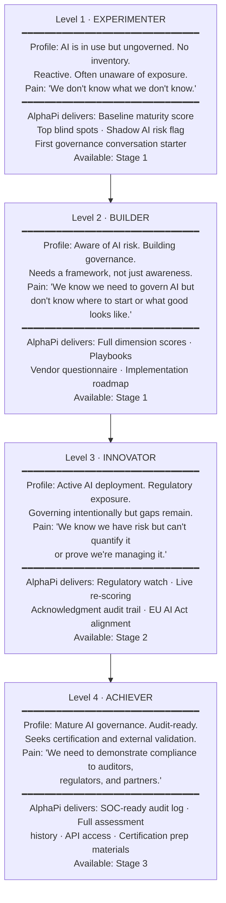

# AlphaPi — SaaS Maturity Model
*Strategic pivot document. Session 59, 2026-03-19.*
*Supersedes: desktop app roadmap, Plan A (RegIntel), Plan B (Pre-Launch) as primary strategy.*
*Desktop app (v0.9.2-beta) is now Stage 0 — proof of concept and learning artifact.*

---

## Strategic Intent

Build a **SaaS platform** compelling enough to acquire within **24 months**. Primary targets:
Armanino · RSM · Moss Adams · Hyperproof · LogicGate · PE compliance rollups.

Path to acquisition:
1. 2–3 paid consulting firm pilots (Stage 1 — web MVP)
2. 5–10 active firms on SaaS (Stage 2 — full product)
3. Clean architecture, SOC-ready audit log, white-label skin, demonstrable roadmap (Stage 3 — acquisition ready)

Revenue is **not required** before exit. Reference customers + demonstrated demand + clean IP is the target.

---

## Product Evolution — Four Stages

```mermaid
flowchart LR
    subgraph S0["Stage 0 · Desktop POC · ✅ DONE"]
        direction TB
        s0a["9-step wizard · 252 Qs\nScoring engine · PDF export\nFreemium model · Mac only"]
        s0b["What we learned:\nDomain model · UX patterns\nBusiness formation · Regulatory\ncontent architecture"]
    end

    subgraph S1["Stage 1 · Web MVP · 90 Days"]
        direction TB
        s1a["Browser-based assessment wizard\nMulti-tenant auth (consulting firm login)\nClient profile management"]
        s1b["Consulting firm branded PDF output\nScoring engine ported from desktop\nNext.js · Supabase · Vercel"]
        s1c["Milestone: 2–3 paid pilots\nArmanino contact · Week 1 call"]
    end

    subgraph S2["Stage 2 · SaaS V1 · 12 Months"]
        direction TB
        s2a["Regulatory Intelligence (HITM pipeline)\nRe-scoring with before/after snapshot\nPro auto-launch check-in modal"]
        s2b["Subscription billing · Stripe\nDirect org channel + consulting channel\nAdmin dashboard (owner-only)"]
        s2c["Milestone: 5–10 active firms\nDemonstrated recurring revenue"]
    end

    subgraph S3["Stage 3 · Platform · 24 Months"]
        direction TB
        s3a["White-label skin (consulting firm brand)\nSOC 1 compliance · Immutable audit log\nAPI access · SSO/SAML"]
        s3b["Remediation roadmap builder\n(consulting firm annotates inside app)\nMulti-org management"]
        s3c["Milestone: Acquisition conversation\nRSM · Armanino · GRC platforms"]
    end

    S0 -->|"Port core to web\nOption C"| S1
    S1 -->|"Add RegIntel\n+ billing"| S2
    S2 -->|"Add white-label\n+ enterprise layer"| S3
```

---

## Customer Maturity Model — Four Levels

Customers don't just buy AlphaPi — they move *through* it. The product serves them differently at each level. Consulting firms bring their clients in at Level 1 and guide them upward. That progression is the consulting firm's billable engagement.

---

## How Product Evolution × Customer Maturity Interlock

| | Level 1 · Experimenter | Level 2 · Builder | Level 3 · Innovator | Level 4 · Achiever |
|---|---|---|---|---|
| **Stage 1 · Web MVP** | ✅ Baseline score, blind spots | ✅ Full scores, playbooks | ⬜ | ⬜ |
| **Stage 2 · SaaS V1** | ✅ | ✅ | ✅ Regulatory watch, re-scoring | ⬜ |
| **Stage 3 · Platform** | ✅ | ✅ | ✅ | ✅ Audit log, API, cert prep |

*Consulting firms onboard clients at Level 1 and bill for guiding them to Level 3+. AlphaPi is the infrastructure that makes that journey measurable and defensible.*

---

## Business Model Evolution

| Stage | Revenue Model | Price Point | Channel |
|---|---|---|---|
| Stage 1 | Flat pilot fee per engagement | $500–$2,500/assessment | Direct (Armanino contact) |
| Stage 2 | Subscription per consulting firm | $300–$800/org/month | Direct + inbound |
| Stage 3 | Platform license + white-label tier | $1,500–$5,000/org/month | Partner/channel + direct |

*Pricing is provisional — validate with Armanino call before locking.*

---

## The Bridge: Stage 0 → Stage 1 (Option C)

**Why web MVP, not enhanced desktop:**
- Desktop app is Mac-only. Consulting firms run Windows. Fatal distribution gap.
- Desktop enhancements are throwaway code — none transfers to SaaS.
- Web MVP = first slice of the real SaaS. Nothing is wasted.

**Stage 1 minimum scope (90 days, full-time + Cursor + Claude):**

| Feature | Notes |
|---|---|
| Auth — org login + user roles | Supabase Auth · consultant + admin roles |
| Multi-tenant data isolation | Supabase RLS (row-level security) — design before code |
| Client profile management | Create / select / archive client orgs |
| 9-step assessment wizard | Port from desktop (React + TypeScript transfers) |
| Scoring engine | Port from desktop (pure TypeScript — no changes needed) |
| Results dashboard | Scores, dimensions, blind spots |
| PDF export with firm branding | Consulting firm logo on output |

**Everything else deferred to Stage 2:**
Regulatory Intelligence · HITM pipeline · billing · admin dashboard · white-label skin · remediation roadmap builder · re-scoring · audit log.

---

## Acquisition Readiness Checklist (Stage 3 Target)

- [ ] 5–10 active consulting firm accounts
- [ ] Demonstrated recurring revenue (any amount)
- [ ] Clean, documented architecture (no Tauri, no desktop dependencies)
- [ ] SOC-ready audit log (immutable, timestamped, append-only)
- [ ] White-label skin capability
- [ ] Regulatory Intelligence active (HITM-reviewed content live)
- [ ] Remediation roadmap builder (consulting firm workflow complete)
- [ ] CLAUDE.md + architecture docs (acquirer's dev team can onboard)
- [ ] PP/ToS updated for SaaS (GDPR data processor agreement for consulting firms)
- [ ] Attorney-reviewed white-label agreement (liability, data ownership, IP)

---

## Immediate Next Actions

| Priority | Action | Owner | When |
|---|---|---|---|
| 🔴 CRITICAL | Call Armanino contact — show desktop app demo, ask what they need | User | This week |
| 🔴 CRITICAL | Architecture session — data model, Supabase RLS, tech stack | User + Claude | After Armanino call |
| 🟡 HIGH | Write Armanino pitch (why AI governance matters, why now) | User + Claude | Before the call |
| 🟡 HIGH | Update CLAUDE.md in desktop repo to reflect SaaS pivot | Claude | This session |
| 🟢 NEXT | Begin Stage 1 build in Cursor | User | Post-architecture session |

---

## What the Desktop App (Stage 0) Gave Us

Do not underestimate what was built. The desktop app is not throwaway — it is the domain model:

- 252 questions across 4 maturity profiles and 6 dimensions — ready to port
- Weighted scoring algorithm — pure TypeScript, transfers directly
- 6-dimension framework with weights — validated and designed
- Freemium model — tested and understood
- Regulatory content architecture — R2, Worker, HITM pipeline (ready to implement in SaaS)
- Business formation — AlphaPi, LLC is real, domain is live, brand is established
- 59 sessions of strategic decisions — documented in decisions.md

*Stage 0 was not a failed product. It was a funded, accelerated design sprint.*
